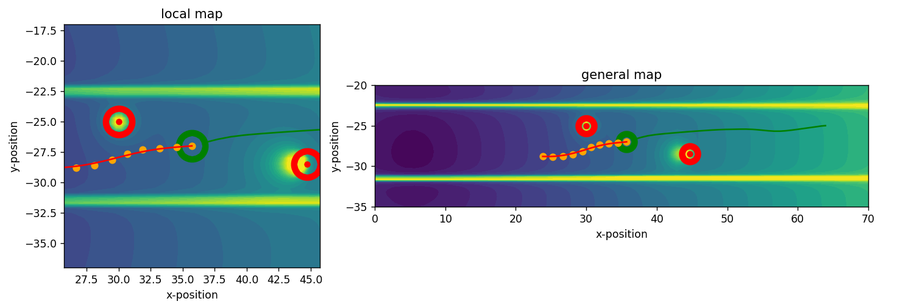

# carla-APF-control



This project aims to utilize the APF (Artificial Potential Field) model for autonomous vehicle control in carla simulation.

Implemented a gradient-force-based APF control method for lane change car control.

Simulation results can be found in the video folder.

## Installation
1. Setup carla environment, carla 13 and python 3.7 are recommended.
2. Clone this repo and run scripts in code.
```
git clone https://github.com/PuzhenYuan/carla-APF-control.git
cd code
# start carla simulation first
python lane_change.py 
```
